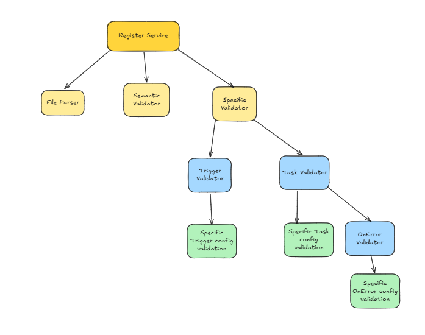

Took a break for 2 days, stupid college work took all the time
So where was i at?
I am done with Yaml Parse Time exceptions
Moving on to generic structural validation
Okay so i throw a Schema Exception for this with all the validation errors
Resolve it in executionExceptionHandler

Going ahead with Semantic Validation
Done

Going ahead with specific validation this will be controlled by SpecificValidator.java

The question is will the Constraint violations hold the property name now also
when i convert from Generic Definition to specific pojos

Okay so it doesnt work that way, imma pass the parent property name for sub validators

for each definition i have a parent validator that resolves the given type and calls the required sub validator

it ends up looking like this, the point is to make this extensible,
lets say we add a new task now we need to update task types enum, and the task validator parent

coming to semantic validations
we need to make sure that the params in config are validated
extract these params first put in a list
we wont know if the fields are correct or not
we can only check the variable being used exists or not

why? 
cause we need not map the output to an class,
if we wanted to we have to allow the user to define the classes

it would be better to create the graph 
then go in order so that we know if a variable being used is present at this point of execution or not

So this is done for now i am going through the nodes using bfs but i am concerned about something
consider:

1. a dependency : a → b
2. another dependency : c -> d -> b

my queue will first have a, then c
while evaluating b will come first but b also need d
but d has not yet been covered so we will come to the conclusion that the output from d is absent and throw an error

ill have to find a new way to handle this

First off is this a necessary part?
assume another scenario:

1. a dependency : a → b -> f
2. another dependency : c -> d -> f -> b

Okay wait i thought there would be a scenario where b can have a dependency which is not possible to have:
There is only one case where this happens

That is when b depends of f and f depends on b i.e. a cycle and i am handling cycles 
So i need not worry about handling these in a particular order

What does dependencies mean in the first place?

It means this task has to run after running other tasks in the dependency list

I need clarity on this will move on to day5