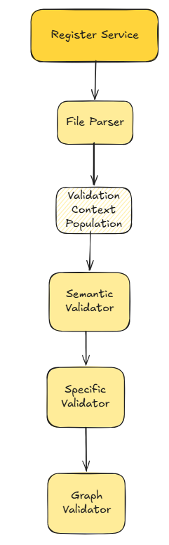
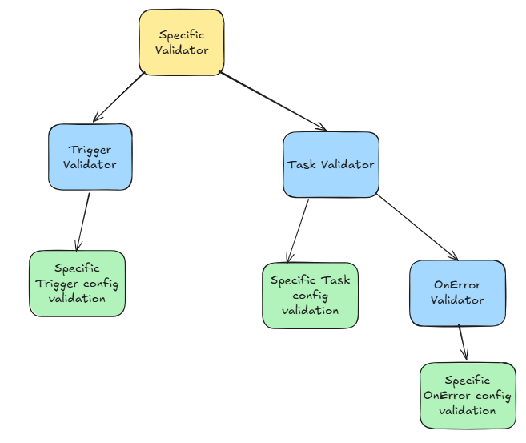

## Register Architecture

### File Parser
- fail fast errors
- Structural errors

### Validation Context Population
- Identify what context is needed across validation layers and fill those here

### Semantic Validator
- Goes through the overall structure before getting specific pojos and performs semantic validation

### Specific Validator
- Goes through each specific pojo and performs semantic and structural validation
- Adds soft dependency according to cases to validation context

### Graph Validator
- Takes all the dependencies and generates a dag
- Check if dag is acyclic

### Note:
- Wherever applicable the errors will show property path and the type of error
- Still need to add a resolver so that we can only put codes when creating ValidationError and the code is resolved into message from ValidationMessages.properties

## Specific Validation Architecture

## Fixes today
- Semantic Valdiator to throw correct errors
- Test till now and fix any issues
- DAG evaluator move from semantic to its own class